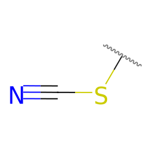

# Fragments


Molecular fragments and inorganic ligands for rapidly building structures

- a variety of ligands for inorganic complexes, including haptic structures
- many kinds of functional group pieces for "click to add" (e.g., phenyl groups)
- amino acids for a peptide builder
- monomers for a polymer builder

## Programmatic addition of fragments

Complement a virtual environment of Python with the `requirements.txt`.  This as
well as the required scripts are compiled in sub folder `scripts`.

For functional groups, SMILES are recorded in the `groups.smi` files, assuming
the attachment point is on the left-hand side, e.g.

```
SC#N thiocyanate
```



The functional group files can then be generated:

```shell
python scripts/rdkit-fragments.py new-groups.smi
```

In general, it is safer to create a new SMILES file for new functional groups -
and then append to the groups.smi after generation. This way, only new files are
created and the existing files are not overwritten.

The `rdkit-fragments.py` script will generate SVG using `rdkit` depiction and
PNG (using `cairosvg`) preview images for each functional group. Only the PNG
images should be added to the repository, since Avogadro does not support SVG
icons currently.

It will also generate a SDF / Molfile using `rdkit` ETKDGv3 conformer generation
and MMFF94 geometry optimization.

The SDF should be converted to CJSON by Open Babel or Avogadro before adding to
the repository.

If RDKit depictions need revision, edit the SVG file (or create a new one from
a program like ChemDraw or ChemDoodle). The `svg2png.py` script uses `cairosvg`
to generate a new PNG image with the appropriate resolution.

## Manual Creation of Ligands

In some cases, the geometry produced by the scripts is poor and a ligand or
functional group needs to be created manually. To manually build new ligands, 
follow the instructions on
<https://two.avogadro.cc/docs/tools/template-tool.html#creating-new-ligands>.

The structure preview by `depict-ligands.py` of .smi by
Avogadro highlights the site of complexation temporarily occupied by the dummy
atom `*` by a dot colored in rgb(255,127,127), or #ff7f7f.
